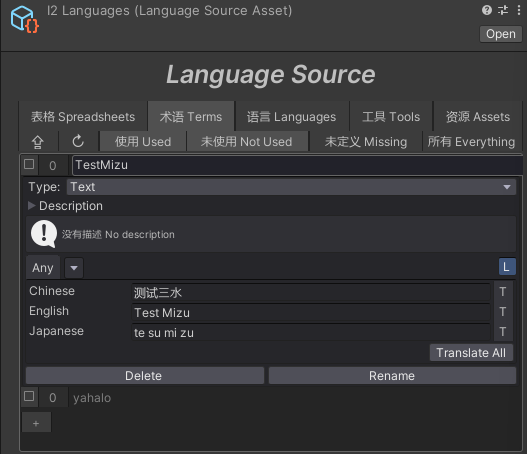

### 本地化系统操作方式：
### source: https://www.bilibili.com/video/BV1cz4y1s7QS?p=15

#### 0.初始化
选中多语言页签，点击打开多语言数据对多语言数据进行初始化，
这将会生成一个多语言配置文件在：`Assets/Editor/I2Localization/I2Languages.asset`,
打开配置文件，选中`语言页签`，添加项目需要的多语言类型，如：`中文`、`英文`、`日文`等，

#### 1.添加多语言术语
打开配置文件，选中`术语页签`，输入一个指定术语的`Key`，再点击添加按钮`Create Key`，
即可生成一个多语言术语，然后在出现的面板输入该术语对应各个语言的文本即可,如图


> 另外，该多语言工具是支持挂载翻译插件的，只要输入其中一个，另外的可以直接点击`Translate`进行翻译，
> 在快速开发时用这个挺好的，详细见官网
> 还有就是，一般都是直接使用配置表直接导入的，认为添加不太现实

#### 2.导出多语言配置
打开YIUI自动化工具，选中多语言页签，直接点导出
这将会生成一个`Editor`下所有的多语言数据配置csv文件在：`Assets/Editor/I2Localization/I2_AllSource.csv`,
然后还有运行时的各个语言对应的csv文件在：`Assets/GameRes/I2Localization`目录下

#### 3.导入多语言配置
打开YIUI自动化工具，选中多语言页签，直接点导入
这将会把文件`Assets/Editor/I2Localization/I2_AllSource.csv`的内容覆盖到多语言配置资产`I2Languages.asset`文件中。

#### 4.挂载脚本
在需要多语言的游戏对象上挂载`I2 Localize`组件，然后在`Term`中选择对应的多语言术语即可，
当然也可在组件上直接创建多语言术语，直接点击`Add Term to Source`即可，

#### 5.运行，脚本切换多语言
> ```csharp
> // 初始化多语言
> await MgrCenter.Inst.Register(I2LocalizeMgr.Inst);
> 
> 
> // 切换多语言
> I2LocalizeMgr.Inst.SetLanguage(language, true);
> ```
> 运行时会自动实例化一个`I2LocalizationSourceManager`游戏对象，该游戏对象上也可直接切换多语言(仅`Editor`)
 
#### 6.自动生成多语言术语脚本
打开多语言配置资产文件`I2Languages.asset`,选中`工具 Tools`页签下的二级页签`脚本Script`，
勾选所有术语，再点击按钮：`使用选定的术语构建脚本`，
即生成脚本文件在`Assets/Scripts/YIUIGeneration/I2Localization/I2Localize.cs`，
里面包含了所有多语言术语的静态字段，方便调用。

